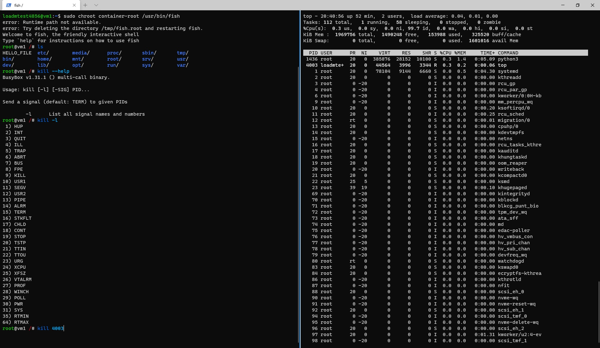
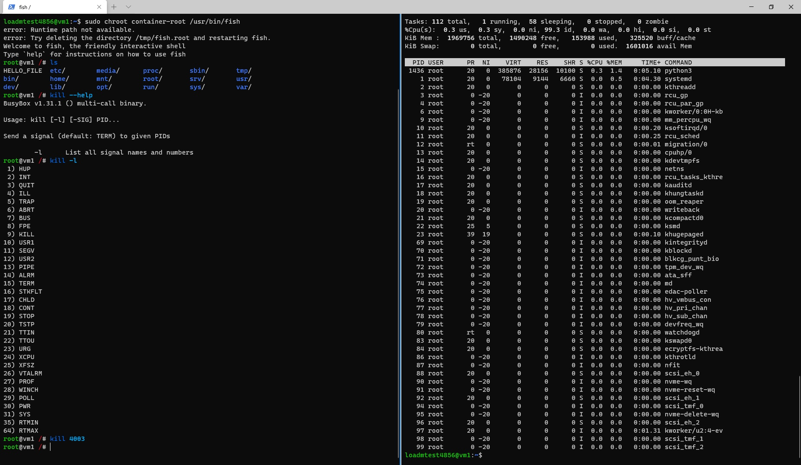
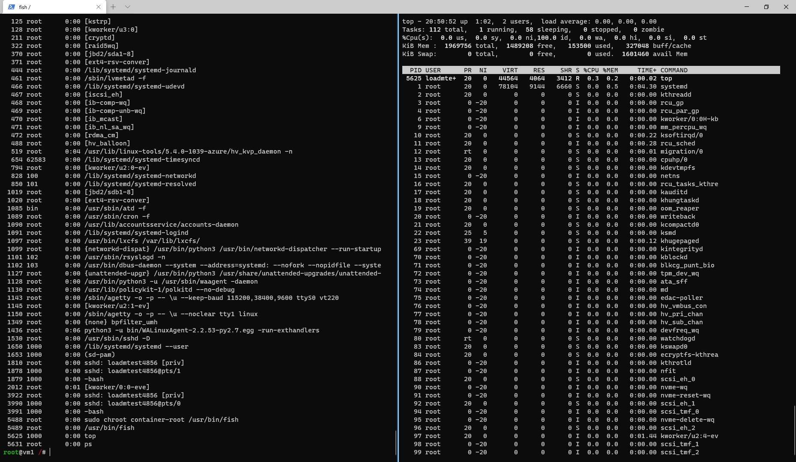
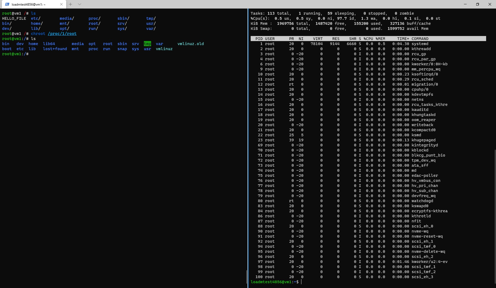

# Moduł 1

## 1. Ćwiczenie 1 – chroot

#### Przygotowanie
```bash
wget http://bit.ly/poznajdocker-fish-tar -O fish.tar #https://github.com/PoznajKubernetes/poznajDocker/blob/master/fish.tar?raw=true
mkdir container-root
cd container-root
tar -xf ../fish.tar

touch HELLO_FILE
```

#### Zadanie 

> Spróbuj z poziomu fish shell uruchomionego za pomocą chroot „ubić” uruchomiony proces top na hoście. Przyda się między innymi polecenie kill <PID>




## Ćwiczenie 2 – chroot część 2

```bash
mount -t proc proc /proc
```

> Jeżeli masz ochotę to spróbuj wymyślić ciekawą „ucieczkę” z powyższego „jail”.

Widok procesów hosta:

Przejćie na roota:


## Ćwiczenie 3 – separacja hostname za pomocą unshare

```bash
hostname #vm1
sudo hostname nowa-nazwa
sudo hostname vm1
sudo unshare --uts /bin/bash
```

## Ćwiczenie 4 – unshare i większa separacja

```bash
sudo unshare --uts --pid --fork --mount-proc \
chroot "container-root" \
   /bin/sh -c \
     "/bin/mount -t proc none /proc && \
      hostname poznaj-docker-demo && \ 
      /usr/bin/fish"
```